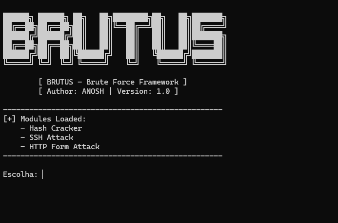

# BRUTUS.py
Ferramenta de teste ético de autenticação (HTTP / SSH / Hash Cracking)

## Preview



# BRUTUS.py – Multi-Protocol Authentication Tester

BRUTUS.py is a **Python-based**, modular authentication testing tool developed for **authorized penetration testing**, **red team practice**, and **educational purposes** in offensive security.

It enables credential testing through **online brute-force attacks** and **offline hash cracking**, covering common authentication scenarios found in real-world environments.

**⚠️ LEGAL AND ETHICAL DISCLAIMER**  
This tool is **strictly for ethical and legal use only**.  
- You **must** have explicit written permission from the system owner before testing any target.  
- Unauthorized use (including against systems you do not own or have permission to test) is **illegal** and may result in criminal charges.  
- The author is **not responsible** for any misuse, damage, or legal consequences arising from the use of this tool.  
Use responsibly. Test only what you are authorized to test.

## Supported Protocols

| Protocol       | Mode                  | Description                                                                 |
|----------------|-----------------------|-----------------------------------------------------------------------------|
| **HTTP Form**  | Online brute-force    | Attacks web login forms (POST-based) with customizable parameters.         |
| **SSH**        | Online brute-force    | Targets SSH authentication using Python-based implementation.              |
| **Hash**       | Offline cracking      | Performs dictionary-based cracking for common hash types (e.g., MD5, SHA). |

## Main Features

- Modular architecture — easy to extend for new protocols
- Multi-threaded execution for improved performance
- Customizable parameters (fields, payloads, targets)
- External wordlist support for dictionary attacks
- Basic success/failure detection mechanisms
- Command-line based usage
- Built for learning and practical security testing

## Planned Improvements

- Advanced wordlist manipulation (rules, combinations)
- Proxy support (HTTP/SOCKS)
- Improved detection handling (tokens, dynamic responses)
- Logging system (detailed reports of attempts)
- CLI enhancements with argparse
- Performance optimizations for hash cracking

## Installation

```bash
# Clone the repository
git clone https://github.com/CATOMBO/BRUTUS.py.git
cd BRUTUS.py
